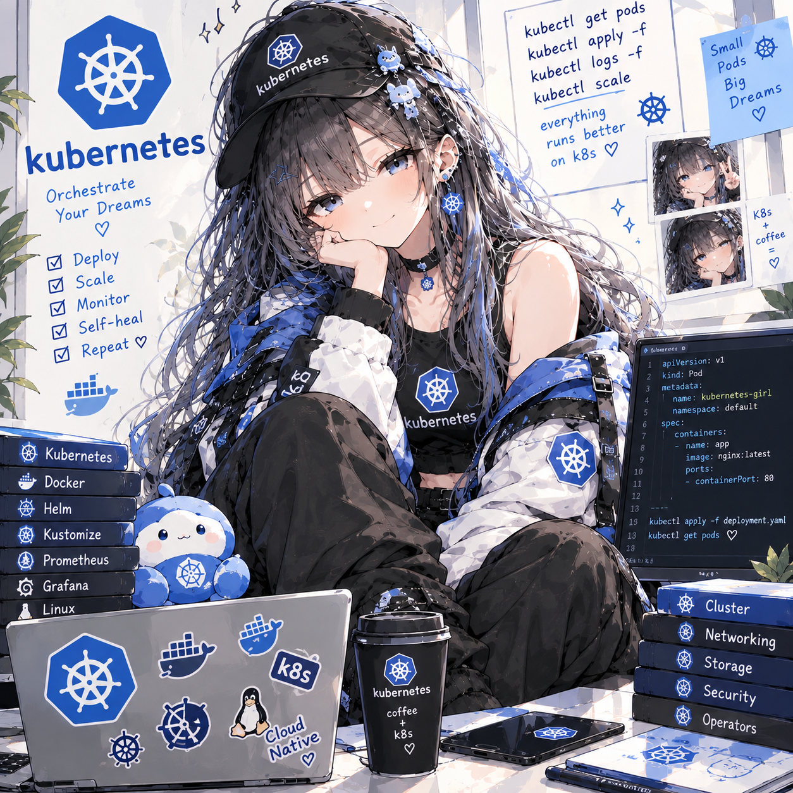

# Kubernetes Lab — от Compose к оркестрации

**Статус: ⚪ методичка готова, прохождение впереди.**
**Сложность: средняя–высокая.** Нужны пройденные Docker Lab и Traefik Lab — сюда переносится ровно их стек, поэтому новый домен не изучается, а сразу нужны настоящие понятия Kubernetes.

## О чём

Миграция уже знакомого стека из `docker-compose.yml` в Kubernetes, шаг за шагом: Pod и Deployment, Service и DNS, ConfigMap/Secret, Volumes и PersistentVolumeClaim, readiness/liveness-пробы, Traefik как Ingress-контроллер через IngressRoute CRD, автоскейлинг через HorizontalPodAutoscaler. Домен нарочно не новый — мигрируется тот же API + frontend + PostgreSQL + Adminer из Traefik Lab, чтобы видеть именно то, что меняется при переходе от одной машины к оркестрации, а не тонуть в шуме нового кода.

## Стек

Kubernetes (kind) + kubectl + Traefik как Ingress-контроллер — тот же стек приложения, что в Traefik Lab: Node.js API + статический frontend + PostgreSQL + Adminer.

## Формат

Методичка [`Kubernetes_Lab_Plan.html`](Kubernetes_Lab_Plan.html) — открывается в браузере, прогресс по чекбоксам сохраняется локально.

## Локальный кластер

Весь лаб — на [kind](https://kind.sigs.k8s.io/) (Kubernetes IN Docker): настоящий control plane и worker-узлы, только упакованные в Docker-контейнеры вместо отдельных машин. Тот же `kubectl`, те же объекты, тот же API, что и в проде.

## Что внутри (3 сессии)

- **Сессия 1** — kind-кластер; первый Pod руками и его смертность; Deployment и самолечение через ReplicaSet; сборка образа API и `kind load`; Service и стабильный адрес поверх набора Pod'ов
- **Сессия 2** — полный стек: ConfigMap/Secret вместо `.env`; Volumes и PersistentVolumeClaim для PostgreSQL; readiness/liveness-пробы; requests/limits
- **Сессия 3** — Traefik снаружи кластера через IngressRoute CRD; HorizontalPodAutoscaler вместо ручных "x3 реплики"; "Production Hell" — финальный сценарий без подсказок

Разделы 1–8 методички — теория (Control Plane/Node, Pod, Deployment, Service, ConfigMap/Secret, Volumes, Probes, Traefik как Ingress-контроллер), раздел 9 — три сессии заданий, разделы 10–13 — чек-лист, глоссарий, вопросы для собеседования, что дальше.

---

Часть сборного репозитория лабораторных работ — [submodule-group-lab](https://github.com/meeymirita/submodule-group-lab).
